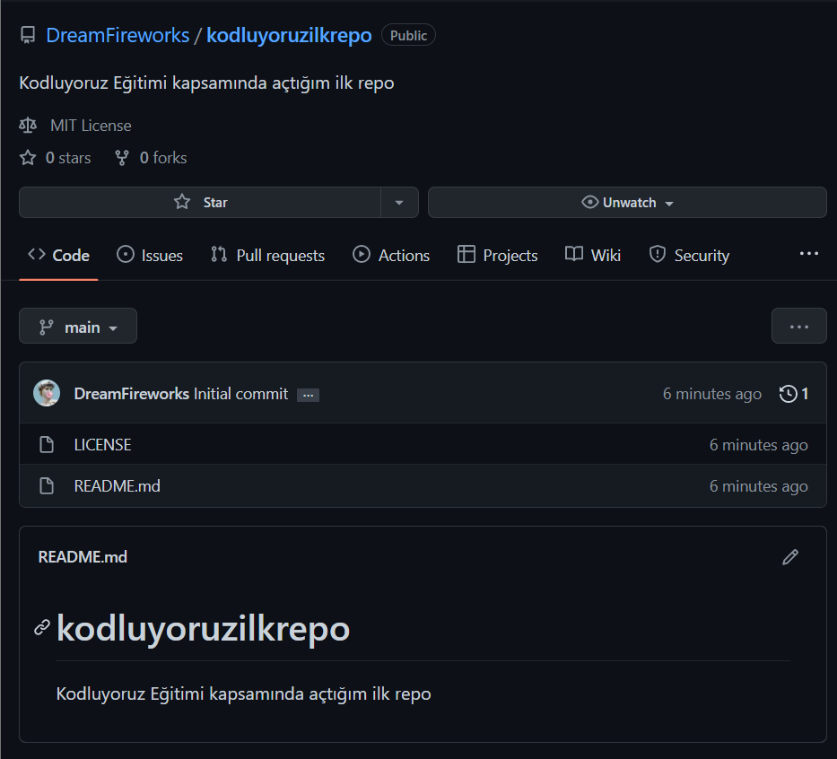

# Kodluyoruz Ilk Repo
Bu repo [Kodluyoruz][https://www.kodluyoruz.org/] Eğitimi kapsamında açtığım ilk repo



## Installation
Önce projeyi klonlamanız gerekemekte:
`git clone https://github.com/DreamFireworks/kodluyoruzilkrepo`

## Usage

Proje klonlandıktan sonra VS Code'u çalıştırabilirsiniz. Havalı bir yolu var:
```
cd kodluyoruzilkrepo
code .
```

## Contributing
Pull requestlere açığım ama bu repoya request atılacağını pek sanmıyorum :D Büyük değişiklikler için lütfen değiştirmek istediğiniz şey hakkında konu açınız.

## License

[MIT](https://choosealicense.com/licenses/mit/)